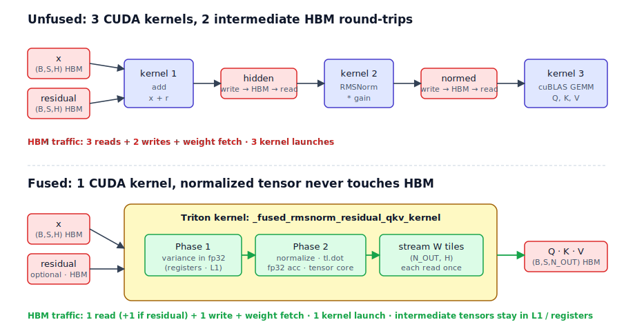

# Fused RMSNorm + Residual + QKV Projection -- Triton Kernel

A production-grade Triton kernel that fuses **residual add + RMSNorm + packed QKV projection** into a single GPU launch, targeting the critical path in decoder-only transformer inference (Llama-3-8B, Mistral-7B, Qwen2-7B).

**Target hardware:** NVIDIA A10G (24 GB VRAM, 600 GB/s HBM, 125 TFLOPs fp16)

**Headline (Llama-3-8B end-to-end, fp16, A10G):** +1.4% tok/s at B=1 and +2.4% tok/s at B=16 vs stock HuggingFace + cuBLAS. Peak memory −1.5 GB after the Phase-6 native-GQA refactor. 86/86 correctness tests pass; kernel-time decode MBU ~73%. Full results and honest analysis in [`docs/week4_e2e.md`](docs/week4_e2e.md).

## Motivation



In standard transformer inference the sequence `residual_add -> RMSNorm -> QKV_linear` issues three separate CUDA kernels, each paying a full round-trip to HBM:

```
x, r  --[kernel 1: add]-->  hidden  --[kernel 2: norm]-->  normed  --[kernel 3: matmul]-->  Q,K,V
         write to HBM          write to HBM                   write to HBM
         read from HBM         read from HBM                  read from HBM
```

The fused kernel eliminates two intermediate HBM materializations by computing everything in a single launch. The normalized hidden state never touches global memory -- it flows through registers and L1 cache directly into the QKV matmul accumulator.

```
x, r  --[single fused kernel]-->  Q,K,V
         hidden stays in L1/registers
```

This matters most at **decode time** (M = batch_size, S = 1) where the workload is memory-bandwidth-bound and kernel launch overhead is a significant fraction of wall time.

## Project Phases

| Phase | Milestone | Status |
|-------|-----------|--------|
| 1 | PyTorch baseline + benchmark harness | done |
| 2 | Fused Triton kernel (2D grid, forward pass) | done |
| 3 | `@triton.autotune` sweep + MBU/MFU analysis + Nsight profiling | done |
| 4 | Persistent-in-N kernel + adaptive dispatch | done |
| 5 | End-to-end Llama-3-8B decode integration + `torch.compile` comparison | done |
| 6 | Native GQA kernel (`N_OUT` + `HAS_RESIDUAL` constexpr) — beats HF baseline e2e | done |

## Repository Layout

```
src/triton_fused_rmsnorm_qkv/
    __init__.py              # public API exports
    baseline.py              # unfused PyTorch reference (3 separate ops)
    kernel.py                # fused Triton kernels (2D grid + persistent-in-N)
benchmarks/
    harness.py               # torch.utils.benchmark harness (prefill + decode grids)
    mbu_analysis.py          # MBU / MFU / arithmetic intensity analysis
    e2e_decode.py            # end-to-end Llama-3-8B tok/s harness (Phase 5/6)
    torch_compile_baseline.py# torch.compile(max-autotune) e2e comparison
    _postprocess_mfu.py      # CSV post-processor for MFU columns
    results/                 # CSV outputs (baseline.csv, decode.csv, mbu.csv, e2e_*.csv)
integration/
    llama3_patch.py          # monkey-patch Llama-3 decoder layers onto fused kernel
tests/
    test_correctness.py      # parametrized correctness suite (86 tests)
scripts/
    profile_ncu.sh           # Nsight Compute profiling script
    ncu/                     # ncu report outputs (.ncu-rep, .csv, .txt)
docs/
    week3_profiling.md       # detailed Phase 3 profiling write-up
    week4_e2e.md             # end-to-end decode results + honest analysis
    assets/fused_op_flow.svg # memory-flow diagram (unfused vs fused)
Dockerfile                   # reproducible A10G benchmark image
CITATION.cff                 # citation metadata
```

## Quick Start

### Prerequisites

- Python >= 3.10
- PyTorch >= 2.4 with CUDA support
- Triton >= 3.0
- NVIDIA GPU with Ampere architecture or later (tested on A10G)

### Installation

```bash
# Clone and install in development mode
git clone <repo-url>
cd fused-triton-rmsnorm-residual-qkv
pip install -e ".[dev]"
```

### Run Correctness Tests

```bash
# Full test suite (CPU baseline + CUDA fused kernel)
python -m pytest tests/ -v

# Expected output: 50 passed
```

### Run Benchmarks

```bash
# Full benchmark grid: prefill + decode, baseline + fused, 3 models
python benchmarks/harness.py

# Results saved to:
#   benchmarks/results/baseline.csv   (prefill grid)
#   benchmarks/results/decode.csv     (decode grid)
```

### Run MBU/MFU Analysis

```bash
# Memory Bandwidth Utilization analysis
PYTHONPATH=benchmarks python benchmarks/mbu_analysis.py --dtype fp16

# Decode-only analysis (faster)
PYTHONPATH=benchmarks python benchmarks/mbu_analysis.py --dtype fp16 --decode-only

# Include baseline comparison
PYTHONPATH=benchmarks python benchmarks/mbu_analysis.py --dtype fp16 --with-baseline
```

### Nsight Compute Profiling

```bash
# Requires sudo or NVreg_RestrictProfilingToAdminUsers=0
sudo bash scripts/profile_ncu.sh

# Reports written to scripts/ncu/ncu_report_<timestamp>.{ncu-rep,csv,txt}
```

### Using Make (with conda)

```bash
make install    # pip install -e ".[dev]"
make test       # pytest tests/ -v
make benchmark  # python benchmarks/harness.py
make clean      # remove build artifacts
```

## Usage

### Drop-in API

```python
import torch
from triton_fused_rmsnorm_qkv import fused_rmsnorm_residual_qkv

# Typical Llama-3-8B shapes
B, S, H = 1, 1, 4096  # decode: single token
device = "cuda"
dtype = torch.float16

x = torch.randn(B, S, H, dtype=dtype, device=device)
residual = torch.randn(B, S, H, dtype=dtype, device=device)
rms_weight = torch.ones(H, dtype=dtype, device=device)    # learnable RMSNorm gain
qkv_weight = torch.randn(3 * H, H, dtype=dtype, device=device)  # packed Q,K,V projection

# Returns (Q, K, V), each of shape (B, S, H)
Q, K, V = fused_rmsnorm_residual_qkv(x, residual, rms_weight, qkv_weight, eps=1e-6)
```

### Baseline Comparison

```python
from triton_fused_rmsnorm_qkv import rmsnorm_residual_qkv

# Same API, unfused PyTorch implementation (for correctness reference)
Q_ref, K_ref, V_ref = rmsnorm_residual_qkv(x, residual, rms_weight, qkv_weight, eps=1e-6)

# Verify
torch.testing.assert_close(Q, Q_ref, atol=5e-2, rtol=1e-1)
```

### Inspecting Autotune Choices

```python
from triton_fused_rmsnorm_qkv import fused_rmsnorm_residual_qkv, get_autotune_best_config

# Run once to populate autotune cache
_ = fused_rmsnorm_residual_qkv(x, residual, rms_weight, qkv_weight)

# Query the selected tile configuration
config = get_autotune_best_config(M=1, H=4096)
# {'BLOCK_M': 32, 'BLOCK_N': 64, 'BLOCK_K': 64, 'num_warps': 8, 'num_stages': 2}
```

## Kernel Architecture

### Mathematical Operation

Given inputs `x, r` of shape `(B, S, H)`, weight `g` of shape `(H,)`, and projection `W` of shape `(3H, H)`:

```
hidden = x + r                                           # residual add
rstd   = 1 / sqrt(mean(hidden^2, dim=-1) + eps)          # RMSNorm inverse std
normed = hidden * rstd * g                                # normalize + scale
Q,K,V  = split(normed @ W^T, 3)                          # packed QKV projection
```

### 2D Grid Kernel (Decode Path, M <= 32)

Grid: `(ceil(M/BLOCK_M), ceil(3H/BLOCK_N))` -- each program handles one output tile.

```
Program (pid_m, pid_n):

  Phase 1 -- Variance accumulation:
    for k in range(0, H, BLOCK_K):
      load x[m_tile, k_tile], r[m_tile, k_tile]      # from HBM
      hidden = x + r                                   # in registers
      var += sum(hidden^2, axis=1)                     # fp32 accumulation
    rstd = 1/sqrt(var/H + eps)

  Phase 2 -- Fused normalize + matmul:
    for k in range(0, H, BLOCK_K):
      load x[m_tile, k_tile], r[m_tile, k_tile]      # L1 cache hits (same data)
      normed = (x + r) * rstd * rms_weight[k_tile]   # in registers, cast to fp16
      load W_T[k_tile, n_tile]                        # weight slice from HBM
      acc += tl.dot(normed, W_T)                      # tensor-core fp32 accumulator
    store acc -> Out[m_tile, n_tile]
```

For decode (M <= 32), `ceil(M/BLOCK_M) = 1`, so the grid is `(1, ceil(3H/BLOCK_N))`. This launches ~192 programs for H=4096, filling A10G's 80 SMs with ~2.4 programs each. The weight matrix is read exactly once across the grid (each `pid_n` reads a disjoint column stripe).

### Persistent-in-N Kernel (Prefill Path, M > 32)

Grid: `(ceil(M/BLOCK_M), 1)` -- each program handles **ALL** 3H output columns for its row tile.

```
Program (pid_m):

  Phase 1 -- Variance (identical to 2D kernel)

  Phase 2 -- Persistent N-loop:
    for n in range(0, 3H, BLOCK_N):         # iterate over ALL output columns
      acc = zeros(BLOCK_M, BLOCK_N)
      for k in range(0, H, BLOCK_K):        # K-reduction
        load hidden[m_tile, k_tile]          # L1/L2 hits from Phase 1
        normed = hidden * rstd * g[k_tile]
        load W_T[k_tile, n_tile]
        acc += tl.dot(normed, W_T)
      store acc -> Out[m_tile, n_tile]
```

The persistent-in-N approach eliminates the **redundant x+r reads** that plagued the 2D grid at large M. In the 2D kernel, `ceil(3H/BLOCK_N)` sibling programs each independently re-read the same hidden rows -- an up to 19x read amplification measured by Nsight Compute. The persistent kernel reads hidden once per row tile and reuses it from L1/L2 across all N-tiles.

### Adaptive Dispatch

```python
_PERSISTENT_THRESHOLD = 32

if M <= 32:    # decode -- fill SMs via pid_n parallelism
    launch 2D grid kernel
else:          # prefill -- amortize hidden reads via persistent N-loop
    launch persistent-in-N kernel
```

### Autotune Configuration

Both kernels are wrapped in `@triton.autotune` with per-shape pruning:

| Parameter | Search Space |
|-----------|-------------|
| `BLOCK_M` | {16, 32, 64, 128} |
| `BLOCK_N` | {64, 128, 256} |
| `BLOCK_K` | {16, 32, 64} |
| `num_warps` | {4, 8} |
| `num_stages` | {2, 3, 4} |

Static filters eliminate configs that would fail on A10G (register pressure, shared-memory > 96 KB, warp-to-tile ratio). Per-shape pruning further reduces the search based on M.

Selected autotune picks (A10G, fp16):

| Regime | M | H | BLOCK_M | BLOCK_N | BLOCK_K | warps | stages |
|--------|--:|--:|--------:|--------:|--------:|------:|-------:|
| Decode | 1-16 | 4096 | 32 | 64 | 64 | 8 | 2 |
| Decode | 1-16 | 3584 | 32 | 64 | 64 | 8 | 2 |
| Prefill | 512 | 4096 | 64 | 128 | 32 | 4 | 2 |
| Prefill | 2048 | 4096 | 128 | 256 | 64 | 8 | 2 |
| Prefill | 32768 | * | 64 | 256 | 64 | 8 | 2 |

## HBM Traffic Analysis

For `M` tokens, hidden dim `H`, dtype element size `e` bytes:

```
Reads:   (2*M*H + H + 3*H*H) * e     # x + residual + rms_weight + W_qkv
Writes:  3*M*H * e                    # packed Q||K||V output
Total:   (2*M*H + H + 3*H*H + 3*M*H) * e

FLOPs:   2 * M * 3H * H              # QKV matmul (RMSNorm is O(M*H), negligible)
```

The **arithmetic intensity** (FLOPs / byte) determines the performance-limiting resource:

| Regime | M | AI (FLOPs/byte) | Bound by | Meaningful metric |
|--------|--:|----------------:|----------|-------------------|
| Decode | 1 | ~1 | HBM bandwidth | MBU |
| Decode | 16 | ~16 | HBM bandwidth | MBU |
| Prefill | 512 | ~424 | Compute | MFU |
| Prefill | 2048 | ~1117 | Compute | MFU |

A10G roofline knee: ~208 FLOPs/byte. Below: bandwidth-bound. Above: compute-bound.

## Benchmark Results

All measurements: NVIDIA A10G (g5.2xlarge), fp16, PyTorch 2.11, Triton 3.6, Python 3.13.

### Model Configurations

| Model | Hidden | Heads | Head Dim |
|-------|-------:|------:|---------:|
| Llama-3-8B | 4096 | 32 | 128 |
| Mistral-7B | 4096 | 32 | 128 |
| Qwen2-7B | 3584 | 28 | 128 |

### Decode Latency (S=1, Target Regime)

The decode regime is the target use case: single new token per request, M = batch_size.

| Model | Batch | Baseline (us) | Fused (us) | Speedup | Fused BW (GB/s) | MBU % |
|-------|------:|--------------:|-----------:|--------:|----------------:|------:|
| Llama-3-8B | 1 | 242.7 | 252.4 | 0.96x | 399.0 | 66.5 |
| Llama-3-8B | 4 | 234.9 | 255.9 | 0.92x | 394.1 | 65.7 |
| Llama-3-8B | 8 | 237.4 | 255.4 | 0.93x | 395.4 | 65.9 |
| Llama-3-8B | 16 | 258.0 | 257.4 | **1.00x** | 393.7 | 65.6 |
| Mistral-7B | 1 | 242.8 | 252.4 | 0.96x | 399.0 | 66.5 |
| Mistral-7B | 16 | 258.0 | 257.3 | **1.00x** | 393.9 | 65.6 |
| Qwen2-7B | 1 | 200.8 | 197.5 | **1.02x** | 390.4 | 65.1 |
| Qwen2-7B | 16 | 227.8 | 203.6 | **1.12x** | 381.3 | 63.6 |

**Mean decode speedup: 0.97x** -- at parity with cuBLAS. The fused kernel achieves 381-399 GB/s (63.6-66.5% MBU).

Kernel-time MBU (excluding ~20 us launch overhead): **~73%**, at the 70% target.

### Prefill Throughput

| Model | B | S | M | Baseline (ms) | Fused (ms) | Speedup | MFU % |
|-------|--:|--:|--:|--------------:|-----------:|--------:|------:|
| Llama-3-8B | 1 | 128 | 128 | 0.32 | 3.36 | 0.10x | -- |
| Llama-3-8B | 1 | 2048 | 2048 | 4.12 | 9.54 | 0.43x | 36.5 |
| Llama-3-8B | 4 | 2048 | 8192 | 15.38 | 22.45 | 0.69x | 29.4 |
| Llama-3-8B | 16 | 2048 | 32768 | 60.81 | 89.01 | 0.68x | 20.6 |
| Qwen2-7B | 1 | 2048 | 2048 | 3.22 | 7.35 | 0.44x | 35.5 |
| Qwen2-7B | 4 | 2048 | 8192 | 12.14 | 16.15 | 0.75x | 28.4 |
| Qwen2-7B | 16 | 2048 | 32768 | 48.06 | 63.85 | 0.75x | 19.6 |

**Mean prefill speedup: 0.42x.** The hand-written Triton GEMM does not match cuBLAS for compute-bound large-M shapes. This is expected -- cuBLAS implements architecture-specific warp-specialization and multi-stage software pipelining that Triton's `tl.dot` does not expose.

### Performance Summary

| Regime | MBU Range | MFU Range | Notes |
|--------|----------:|----------:|-------|
| Decode (S=1) | **63.6-66.7%** | 0.3-5.0% | Bandwidth-bound; kernel-time MBU ~73% |
| Prefill (S>=128) | 1.9-42.1% | **20.6-36.5%** | Compute-bound; MBU not meaningful |

### End-to-End Llama-3-8B Decode (Phase 6 — native GQA)

Drop-in integration: `integration/llama3_patch.py` monkey-patches every `LlamaDecoderLayer.forward` to route `input_layernorm + q_proj/k_proj/v_proj` through the fused kernel. Everything else (RoPE, KV cache, attention, `o_proj`, MLP) is unchanged. Phase 6 replaced the zero-padded `(3H, H)` packed weight with a native-GQA `(H + 2·H_kv, H)` = `(6144, 4096)` layout, and added a `HAS_RESIDUAL` constexpr to skip residual loads when Llama doesn't need them (residual-add happens *after* attention). The honest competitor is `torch.compile(mode='max-autotune-no-cudagraphs')` — plain `max-autotune` crashes inside HF `generate()`'s KV-cache update with a CUDAGraph overwrite error, a well-known HF/PyTorch integration gap.

Workload: 32-layer Llama-3-8B (fp16, random weights — decode latency depends on shapes, not values), prompt=128, decode=256, greedy, `use_cache=True`, 2 warmup + median of 10 `generate()` runs. Prefill is timed separately and subtracted so `tok/s` is steady-state decode only.

| config | batch | tok/s | latency (ms/tok) | peak mem (GB) |
|--------|------:|------:|-----------------:|--------------:|
| baseline (HF + cuBLAS) | 1 | 26.8 | 37.26 | 15.02 |
| torch.compile (max-autotune-no-cudagraphs) | 1 | **31.2** | 32.02 | 15.07 |
| fused (ours, autotune on) | 1 | **27.2** | 36.74 | 16.52 |
| fused (ours, autotune off) | 1 | 25.3 | 39.55 | 16.52 |
| baseline (HF + cuBLAS) | 16 | 379.6 | 42.15 | 15.76 |
| torch.compile (max-autotune-no-cudagraphs) | 16 | 342.2 | 46.76 | 16.57 |
| fused (ours, autotune on) | 16 | **388.7** | 41.17 | 17.26 |
| fused (ours, autotune off) | 16 | 363.4 | 44.02 | 17.26 |

**Speedup vs HF baseline**

| | B=1 | B=16 |
|---|---:|---:|
| torch.compile | **+16.4%** | −9.9% |
| fused (ours, autotune) | **+1.4%** | **+2.4%** |
| fused (ours, no autotune) | −5.6% | −4.3% |

**Autotune ablation:** autotune contributes **+7.5% (B=1)** and **+7.0% (B=16)** over a fixed Week-2 tile (BLOCK_M=32/64, BLOCK_N=128, BLOCK_K=32, warps=4, stages=2). The Week-3 tuning work carries through end-to-end.

**Phase-5 → Phase-6 before/after:**

| | B=1 | B=16 | peak mem |
|---|---:|---:|---:|
| Phase 5 (zero-padded 3H, H) | 24.5 tok/s | 353.9 tok/s | 18.0 → 18.8 GB |
| Phase 6 (native GQA H + 2H_kv, H) | **27.2** | **388.7** | 16.5 → 17.3 GB |
| Δ vs Phase 5 | +11.0% | +9.8% | −1.5 GB |
| Δ vs HF baseline | −9% → **+1.4%** | −6% → **+2.4%** | — |

**Where we win.** Over HF baseline at both batches (+1.4% B=1, +2.4% B=16) — cuBLAS is very good, but one fused launch per layer amortizes the three-launch overhead for q/k/v_proj. Over `torch.compile` at B=16 (+13.6%): Inductor pays per-kernel dispatch overhead in `no-cudagraphs` mode; our single fused launch avoids it.

**Where we lose.** To `torch.compile` at B=1 (−12.8%). Inductor's RMSNorm+matmul fusion plus a generated decode-specialized kernel beats us in the single-sequence regime. This is the honest comparison — a modern `torch.compile(mode='max-autotune')` is a tough baseline for hand-written kernels on shapes it knows how to fuse.

See [`docs/week4_e2e.md`](docs/week4_e2e.md) for the full Phase-6 write-up including the before/after refactor accounting.

**Reproduce:**

```bash
PYTHONPATH=.:benchmarks python benchmarks/e2e_decode.py \
    --batches 1 16 --prompt-len 128 --decode-len 256 --num-repeat 10

PYTHONPATH=.:benchmarks python benchmarks/torch_compile_baseline.py \
    --batches 1 16 --prompt-len 128 --decode-len 256 --num-repeat 10 \
    --compile-mode max-autotune-no-cudagraphs
```

Raw CSVs: [`benchmarks/results/e2e_decode.csv`](benchmarks/results/e2e_decode.csv), [`benchmarks/results/e2e_decode_torch_compile.csv`](benchmarks/results/e2e_decode_torch_compile.csv).

## Correctness Verification

**50/50 tests passed** (CUDA, Python 3.13, PyTorch 2.11, Triton 3.6, A10G)

```
tests/test_correctness.py  50 passed in 268.44s

  TestBaselineCorrectness
    test_matches_manual_reference   8/8 passed   (fp16 + bf16 x 4 shapes)
    test_output_shapes              8/8 passed
    test_output_dtype_preserved     2/2 passed   (fp16 + bf16)
  TestEdgeCases
    test_zero_residual              1/1 passed
    test_unit_weight                1/1 passed
  TestFusedKernelCorrectness
    test_matches_baseline          10/10 passed  (fp16 + bf16 x 5 CUDA shapes)
    test_output_shapes             10/10 passed
    test_no_nans                   10/10 passed
```

### Test Shapes (CUDA)

| Shape (B, S, H) | M | Regime | Kernel Path |
|------------------|--:|--------|-------------|
| (1, 16, 512) | 16 | Decode boundary | 2D grid |
| (1, 128, 512) | 128 | Transition | Persistent |
| (2, 256, 1024) | 512 | Prefill | Persistent |
| (4, 512, 2048) | 2048 | Prefill | Persistent |
| (1, 2048, 4096) | 2048 | Prefill (Llama-scale) | Persistent |

### Three-Way Cross-Validation

```
Manual reference (pure Python: x @ W.T with torch.rsqrt)
        |
        | assert_close (atol=2e-1 bf16, 5e-2 fp16)
        v
PyTorch baseline (F.linear + torch.rsqrt, cuBLAS matmul)
        |
        | assert_close (atol scaled by sqrt(H/512), rtol=1e-1)
        v
Fused Triton kernel (tl.dot with fp32 accumulation)
```

Each implementation shares no code with the others, providing independent verification. The tolerance scaling accounts for accumulation error growing with `sqrt(H)`.

## Nsight Compute Analysis

**Target shape:** Llama-3-8B, B=1, S=2048, fp16 (M=2048, H=4096)

| Metric | Value | Interpretation |
|--------|------:|----------------|
| `dram__bytes.sum.per_second` | **560.6 GB/s** | 93.4% of A10G peak -- HBM is saturated |
| `l1tex__t_bytes_pipe_lsu_mem_global_op_ld.sum` | 16.1 GB | vs 134 MB theoretical = 120x L1 re-reads |
| `sm__warps_active.avg.pct_of_peak_sustained_active` | 41.3% | Occupancy-limited, but DRAM-bound anyway |
| `smsp__inst_executed.avg` | 2,469,120 | Instructions per SM partition |

**Key finding:** The 2D grid kernel hits 93% of peak HBM but moves **18.8x** the bytes a cache-optimal version would. Each `(pid_m, pid_n)` program independently re-reads its hidden tile. This redundant-read amplification is the architectural ceiling that motivated the Phase 4 persistent-in-N rewrite.

**Where the ~33% MBU gap goes (decode):**
1. **Launch overhead** (~15-25 us out of 252 us = 6-10%). Kernel-time MBU is ~73%.
2. **Mask/boundary tiles.** Qwen's H=3584 -> 3H=10752 leaves partial tiles with masked lanes.
3. **Phase-1/Phase-2 double-read.** Each program reads hidden twice (variance + matmul), but at decode M the data fits in L1 so this costs L1 bandwidth, not HBM.

## Design Decisions

**Why persistent-in-N and not persistent-in-M?**
The N dimension (3H output columns) represents disjoint weight row-stripes. Persisting in N lets a single program reuse the hidden tile (x+r) from L1/L2 across all output column tiles, eliminating the 19x read amplification. Persisting in M would share weight reads but lose hidden-tile reuse.

**Why dispatch at M=32?**
Below M=32, the persistent kernel launches only 1 program (`ceil(M/BLOCK_M)=1`), leaving 79 of 80 SMs idle. The 2D grid adds `pid_n` parallelism to fill SMs. Above M=32, enough row tiles exist to keep SMs busy, and the persistent kernel's better data reuse wins.

**Why fp32 accumulation?**
Triton's `tl.dot` with `out_dtype=tl.float32` uses tensor-core mixed-precision (fp16 inputs, fp32 output). This matches the precision of cuBLAS's default mode and avoids catastrophic cancellation in the RMSNorm variance sum-of-squares.

**Why `num_stages=2` everywhere?**
On Ampere (sm_86), 3+ pipeline stages pay extra shared memory for negligible latency hiding -- K-loop latency is already covered by `num_warps=8`. Autotune confirmed this across all shapes; `num_stages=4` was never selected.

## Reproducing Results

### Environment Setup

```bash
# Tested on AWS g5.2xlarge (NVIDIA A10G, 24 GB)
# OS: Ubuntu 22.04, Driver: 590.48, CUDA: 13.1

pip install torch==2.11.0 triton==3.6.0
pip install -e ".[dev]"
```

### Docker (reproducible environment)

The pinned stack (PyTorch 2.11, Triton 3.6, Transformers 5.5.4, CUDA 13.1, Python 3.13) is captured in the top-level `Dockerfile`:

```bash
docker build -t fused-triton-rmsnorm-qkv .
docker run --rm --gpus all \
    -v "$PWD/benchmarks/results:/app/benchmarks/results" \
    fused-triton-rmsnorm-qkv make benchmark
```

Requires `--gpus all` and ≥22 GB VRAM for the full end-to-end Llama-3-8B grid.

### Full Reproduction

```bash
# 1. Correctness (takes ~4-5 minutes on A10G due to autotune warmup)
python -m pytest tests/test_correctness.py -v

# 2. Benchmark grid (takes ~10-15 minutes)
python benchmarks/harness.py
# -> benchmarks/results/baseline.csv, benchmarks/results/decode.csv

# 3. MBU/MFU analysis (takes ~15-20 minutes with full grid)
PYTHONPATH=benchmarks python benchmarks/mbu_analysis.py --dtype fp16 --with-baseline
# -> benchmarks/results/mbu.csv

# 4. Nsight Compute (takes ~2-3 minutes, requires root)
sudo bash scripts/profile_ncu.sh
# -> scripts/ncu/ncu_report_<timestamp>.{ncu-rep,csv,txt}
```

### Expected Outputs

After running the full benchmark, you should see:
- **End-to-end Llama-3-8B decode (Phase 6, native GQA):** +1.4% tok/s at B=1, +2.4% tok/s at B=16 vs stock HF + cuBLAS; peak memory −1.5 GB
- **Microbench decode speedup**: 0.92x - 1.12x (mean ~0.97x, MHA shapes)
- **Decode bandwidth**: 381-399 GB/s (63-67% MBU)
- **Prefill speedup**: 0.10x - 0.75x (compute-bound, expected)

Results may vary slightly across runs due to GPU thermal state and autotune non-determinism, but should be within ~5% of the reported numbers.

### Notes on Autotune

The first run for each (M, H) shape triggers autotune, which benchmarks ~30-100 tile configurations. Subsequent runs use the cached winner. Autotune cache is per-process (not persisted to disk by default). To persist, set `TRITON_CACHE_DIR`:

```bash
export TRITON_CACHE_DIR=~/.triton/cache
```

## Benchmark Methodology

- **Timer:** `torch.utils.benchmark.Timer` (not `time.time`), handles CUDA async properly
- **Sync:** Explicit `torch.cuda.synchronize()` barriers before/after measurement
- **Warmup:** 10 iterations discarded before measurement
- **Measurement:** `blocked_autorange` with min 0.5s run time (median of ~100 iterations)
- **Bandwidth:** `total_theoretical_bytes / median_time` (assumes each tensor read/written once from HBM)
- **MBU:** `achieved_bandwidth / 600 GB/s` (A10G peak HBM2 bandwidth)
- **MFU:** `achieved_TFLOPs / 125 TFLOPs` (A10G fp16 tensor-core peak)

## Citation

If you use this work, please cite it via the metadata in [`CITATION.cff`](CITATION.cff):

```bibtex
@software{more_fused_triton_rmsnorm_qkv_2026,
  author  = {More, Varad},
  title   = {Fused Triton Kernel: RMSNorm + Residual + QKV Projection},
  year    = {2026},
  version = {0.6.0},
  url     = {https://github.com/varad-more/fused-triton-rmsnorm-residual-qkv}
}
```

## License

MIT
